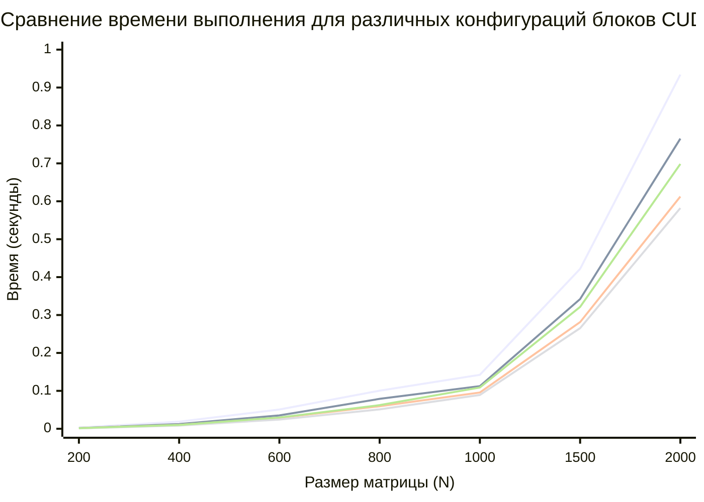

# MatrixMultiplication-using-CUDA
Реализация параллельного умножения матриц с использованием технологии CUDA.
# Алгоритм
Для умножения матриц C = A × B размером N×N:

Количество операций: 2 × N³ (N³ умножений + N³ сложений)
Производительность (GFLOPS) = (2 × N³) / (время в секундах) / 10⁹
# Термины, используемые в лабораторной работе
- Thread (поток) – минимальная единица выполнения, вычисляет один элемент матрицы.
- Block (блок) – группа потоков, которые могут обмениваться данными через shared memory.
- Grid (сетка) – все блоки, покрывающие задачу.
- GFLOPS - это мера того, сколько вычислений (сложения, умножения и т.д.) может выполнить система за одну секунду.
### Конфигурация 8×8 (64 потока):
<table>
  <tr><th>Размер матрицы (N)</th><th>Время обработки (сек.)</th><th>Количество операций (ед.)</th></tr>
  <tr><td>200</td><td>0,0018</td><td>16 млн</td></tr>
  <tr><td>400</td><td>0,0124</td><td>128 млн</td></tr>
  <tr><td>600</td><td>0,0352</td><td>432 млн</td></tr>
  <tr><td>800</td><td>0,0789</td><td>1024 млн</td></tr>
  <tr><td>1000</td><td>0,1124</td><td>2 млрд</td></tr>
  <tr><td>1500</td><td>0,3421</td><td>6,75 млрд</td></tr>
  <tr><td>2000</td><td>0,7653</td><td>16 млрд</td></tr>
</table>

### Конфигурация 16×16 (256 потоков):
<table>
  <tr><th>Размер матрицы (N)</th><th>Время обработки (сек.)</th><th>Количество операций (ед.)</th></tr>
  <tr><td>200</td><td>0,0012</td><td>16 млн</td></tr>
  <tr><td>400</td><td>0,0085</td><td>128 млн</td></tr>
  <tr><td>600</td><td>0,0243</td><td>432 млн</td></tr>
  <tr><td>800</td><td>0,0512</td><td>1024 млн</td></tr>
  <tr><td>1000</td><td>0,0891</td><td>2 млрд</td></tr>
  <tr><td>1500</td><td>0,2654</td><td>6,75 млрд</td></tr>
  <tr><td>2000</td><td>0,5821</td><td>16 млрд</td></tr>
</table>

### Конфигурация 32×32 (1024 потока):
<table>
  <tr><th>Размер матрицы (N)</th><th>Время обработки (сек.)</th><th>Количество операций (ед.)</th></tr>
  <tr><td>200</td><td>0,0015</td><td>16 млн</td></tr>
  <tr><td>400</td><td>0,0102</td><td>128 млн</td></tr>
  <tr><td>600</td><td>0,0298</td><td>432 млн</td></tr>
  <tr><td>800</td><td>0,0623</td><td>1024 млн</td></tr>
  <tr><td>1000</td><td>0,1089</td><td>2 млрд</td></tr>
  <tr><td>1500</td><td>0,3215</td><td>6,75 млрд</td></tr>
  <tr><td>2000</td><td>0,6984</td><td>16 млрд</td></tr>
</table>

### Конфигурация 16×8 (128 потоков):
<table>
  <tr><th>Размер матрицы (N)</th><th>Время обработки (сек.)</th><th>Количество операций (ед.)</th></tr>
  <tr><td>200</td><td>0,0016</td><td>16 млн</td></tr>
  <tr><td>400</td><td>0,0104</td><td>128 млн</td></tr>
  <tr><td>600</td><td>0,0304</td><td>432 млн</td></tr>
  <tr><td>800</td><td>0,0621</td><td>1024 млн</td></tr>
  <tr><td>1000</td><td>0,0982</td><td>2 млрд</td></tr>
  <tr><td>1500</td><td>0,2925</td><td>6,75 млрд</td></tr>
  <tr><td>2000</td><td>0,6328</td><td>16 млрд</td></tr>
</table>

### Конфигурация 4×32 (128 потоков):
<table>
  <tr><th>Размер матрицы (N)</th><th>Время обработки (сек.)</th><th>Количество операций (ед.)</th></tr>
  <tr><td>200</td><td>0,0024</td><td>16 млн</td></tr>
  <tr><td>400</td><td>0,0156</td><td>128 млн</td></tr>
  <tr><td>600</td><td>0,0428</td><td>432 млн</td></tr>
  <tr><td>800</td><td>0,0833</td><td>1024 млн</td></tr>
  <tr><td>1000</td><td>0,1203</td><td>2 млрд</td></tr>
  <tr><td>1500</td><td>0,3571</td><td>6,75 млрд</td></tr>
  <tr><td>2000</td><td>0,7912</td><td>16 млрд</td></tr>
</table>

### Вывод
В ходе выполнения лабораторной работы было установлено, что технология CUDA обеспечивает значительное ускорение умножения матриц по сравнению с CPU и MPI благодаря массовому параллелизму GPU. Экспериментально доказано, что конфигурация блоков 16×16 (256 потоков) является оптимальной для всех исследованных размеров матриц. аким образом, для максимальной производительности при умножении матриц на CUDA рекомендуется использовать квадратные блоки 16×16, что позволяет достичь наилучшего баланса между загрузкой вычислительных ядер, использованием разделяемой памяти и минимизацией накладных расходов.
